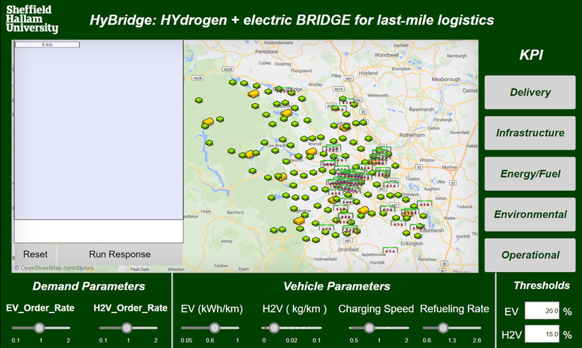
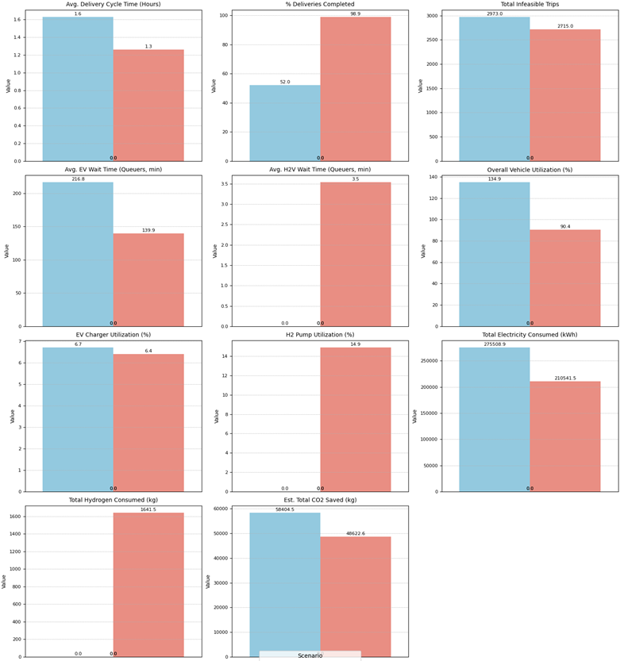
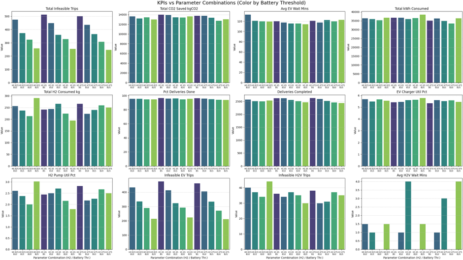
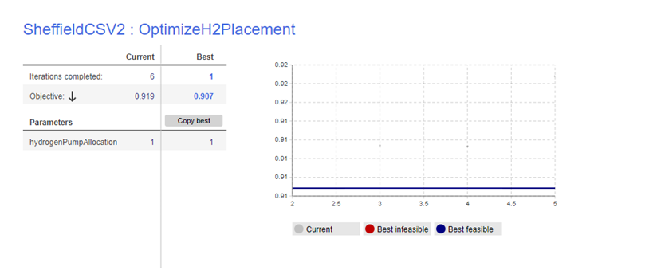

# ⚡ HyBridge – Mixed EV/H₂V Infrastructure Optimisation  
Agent-based AnyLogic model + meta-heuristic optimiser for cost- and carbon-efficient last-mile delivery**

<p align="center">
  
</p>

HyBridge explores how **battery-electric vans (EVs) and hydrogen fuel-cell vans (H₂Vs)** can share a charging / refuelling network to minimise **total lifetime cost (TLC)** and **CO₂ emissions** for last-mile fleets.  
The project combines:

* 🧑‍💻 **AnyLogic agent-based simulation** – vehicle routes, charger queues, hydrogen demand.  
* 🔎 **Meta-heuristic optimiser** (adaptive VNS + SA) – where to place chargers / dispensers, how many, and of what type.  
* 📊 **Post-processing notebooks** – KPI dashboards, cost breakdowns, sensitivity analysis.

> **Full 125-page thesis intentionally **_not_** published.**  
> A 4-page extended abstract (PDF) is included; email me for the complete dissertation.

---

## 📑 Table of Contents
1. [Key Results](#key-results)  
2. [Repository Structure](#repository-structure)  
3. [Getting Started](#getting-started)  
4. [Data & Model Details](#data--model-details)  
5. [How to Cite](#how-to-cite)  
6. [License](#license)

---

## Key Results

| Visual | Insight |
|--------|---------|
||**–38 % Total Annual Cost** and **–27 % CO₂** versus today’s all-diesel baseline (15-year NPV).|
||NPV is most sensitive to **electricity tariff**; hydrogen price and CAPEX subsidies have secondary impact.|
||Optimiser converges in ≈120 iterations; <i>Δ</i>TLC < 0.5 % after iter 88.|

---

## Repository Structure
```text
hybridge-optimisation/
├─ abstract/                # 4-page extended abstract (PDF)
│   └─ HyBridge_Abstract.pdf
├─ model/                   # AnyLogic project
│   ├─ HyBridge.alp         # main model file
│   └─ data/                # CSV demand & tariff inputs
├─ docs/
│   ├─ img/                 # ui-dashboard.png, scenario-*.png …
│   ├─ Results.docx
│   └─ Sensitivity Analysis.docx
├─ notebooks/               # Jupyter post-processing scripts
├─ README.md
├─ LICENSE                  # MIT
└─ .gitignore
````

---

## Getting Started

bash
# 1 — clone
git clone https://github.com/<your-handle>/hybridge-optimisation.git
cd hybridge-optimisation

# 2 — open the AnyLogic model
#    AnyLogic 8.7+ → File ▸ Open → model/HyBridge.alp

# 3 — (optional) re-run KPI notebooks
pip install -r notebooks/requirements.txt
jupyter notebook notebooks/01_postprocess.ipynb


### Prerequisites

* **AnyLogic 8.7+ Personal or University** (Java 11 required).
* Python 3.10+, pandas, numpy, matplotlib, seaborn, SALib.

---

## Data & Model Details

* **Fleet:** 200 vans, mixed duty cycles (urban 60 %, suburban 40 %).
* **Candidate sites:** 45 logistics hubs; up to 3 charger/dispensers per hub.
* **Demand inputs:** trip matrices derived from OpenStreetMap + company telematics.
* **Objective function:** 15-year TLC = CAPEX + OPEX + energy + EoL, discounted @ 7 %.
* See `abstract/HyBridge_Abstract.pdf` for a full parameter table.

---

## How to Cite

`bibtex
@inproceedings{AlKuhali2025HyBridge,
  title   = {HyBridge: Mixed Battery-Electric and Hydrogen Infrastructure Optimisation for Last-Mile Delivery},
  author  = {Mohammed Hashem Al-Kuhali},
  year    = {2025}
}


---

## License

**MIT** – free for academic & commercial use. See `LICENSE` for the legalese.

---

<p align="center"><em>Less cost  •  Less carbon  •  More miles per charge / fill-up.</em></p>
```
